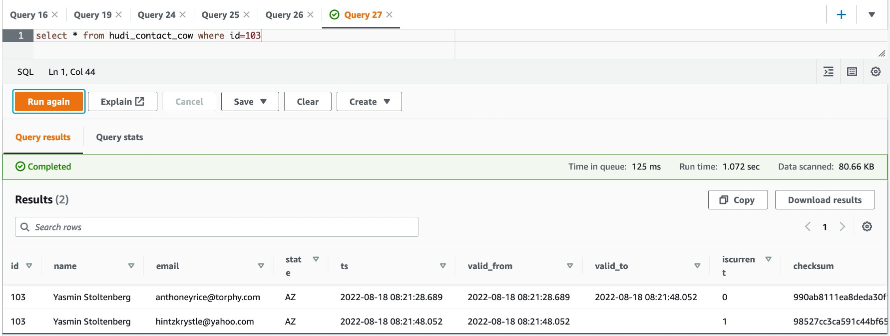
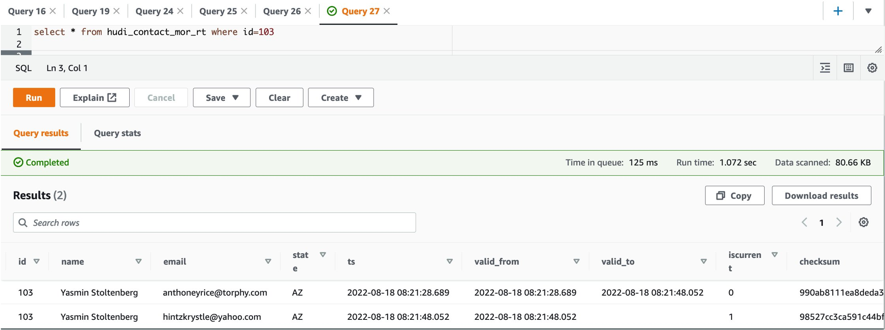
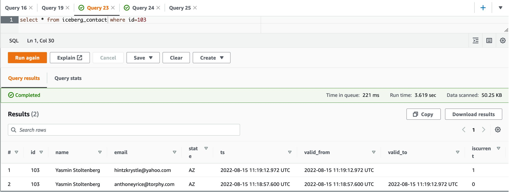
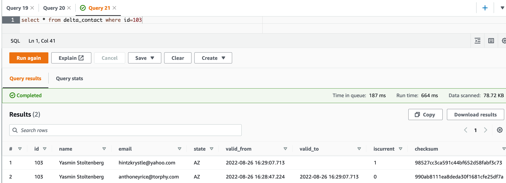

## EMR on EKS quick start for Apache Hudi, Apache Iceberg and Delta Lake 

This repository holds sample code for the blog: Get a quick start with Apache Hudi, Apache Iceberg and Delta Lake with EMR on EKS. It gets you familiar with three transactonal storage frameworks in a real-world use case. For a demo purpose, we will show you how to ETL incremental data changes in Data Lake by implementing Slowly Changing Dimension Type 2 (SCD2), then deploy them with Amazon EMR on Amazon EKS. 

## Examples
* [1. Run Apache Hudi with EMR on EKS](#Example-1-Run-Apache-Hudi-with-EMR-on-EKS) 
* [2. Run Apache Iceberg with EMR on EKS](#Example-2-Run-Apache-Iceberg-with-EMR-on-EKS) 
* [3. Run Open-Source Delta Lake with EMR on EKS](#Example-3:-Run-Open-Source-Delta-Lake-with-EMR-on-EKS)


## Prerequisite

- [eksctl](https://docs.aws.amazon.com/emr/latest/EMR-on-EKS-DevelopmentGuide/setting-up-eksctl.html) is installed
- [AWS CLI](https://docs.aws.amazon.com/emr/latest/EMR-on-EKS-DevelopmentGuide/setting-up-cli.html) is installed or upgraded
- Install [kubectl](https://docs.aws.amazon.com/eks/latest/userguide/install-kubectl.html) 

For a quick start, you can use [AWS CloudShell](https://console.aws.amazon.com/cloudshell) which has included AWS CLI and kubectl.

## Clone the project

Download the sample project either to your computer or to your AWS CloudShell Console.
```
git clone https://github.com/aws-samples/emr-on-eks-hudi-iceberg-delta
cd emr-on-eks-hudi-iceberg-delta
```
## Set up test environment
Run the following provision script to setup a test environment. The infrastructure deployment includes:

* a new S3 bucket to store sample data and job code
* an EKS cluster (version 1.21) in a new VPC across 2 AZs
* an EMR virtual cluster in the same VPC
* registered to emr namespace in EKS
* EMR on EKS configuration is done
* a job execution role contains DynamoDB access, because we use the DDB to provides concurrency controls that ensure atomic transaction with Hudi & Iceberg tables

```bash
export AWS_REGION=us-east-1
export EKSCLUSTER_NAME=eks-quickstart
./blog_provision.sh

# upload sample contact data to S3
export ACCOUNTID=$(aws sts get-caller-identity —query Account —output text)
aws s3 sync data s3://emr-on-eks-quickstart-${ACCOUNTID}-${AWS_REGION}/blog/data
```

## Example 1: Run Apache Hudi with EMR on EKS

The following python code snippet demonstrates the SCD type2 implementation logic. It creates Hudi tables in “default” database against Glue Data Catalog. See the full version script :

[hudi_scd_script.py](./hudi_scd_script.py)
```bash
# Read incremental contact CSV file with extra SCD columns
delta_csv_df = spark.read.schema(contact_schema).format("csv")\
.load(f"s3://{S3_BUCKET_NAME}/.../update_contacts.csv")\
.withColumn("ts", lit(current_timestamp()).cast(TimestampType()))\
.withColumn("valid_from", lit(current_timestamp()).cast(TimestampType()))\
.withColumn("valid_to", lit("").cast(TimestampType()))\
.withColumn("checksum",md5(concat(col("name"),col("email"),col("state"))))\
.withColumn('iscurrent', lit(1).cast("int"))

## Find existing records to be expired
join_cond = [initial_hudi_df.checksum != delta_csv_df.checksum,
             initial_hudi_df.id == delta_csv_df.id,
             initial_hudi_df.iscurrent == 1]
contact_to_update_df = (initial_hudi_df.join(delta_csv_df, join_cond)
                      .select(initial_hudi_df.id,
                                ....
                              initial_hudi_df.valid_from,
                              delta_csv_df.valid_from.alias('valid_to'),
                              initial_hudi_df.checksum
                              )
                      .withColumn('iscurrent', lit(0).cast("int"))
                      )
                      
merged_contact_df = delta_csv_df.unionByName(contact_to_update_df)

# Upsert
merged_contact_df.write.format('org.apache.hudi')\
                    .option('hoodie.datasource.write.operation', 'upsert')\
                    .options(**hudiOptions) \
                    .mode('append')\
                    .save(TABLE_LOCATION)

````

In the job script, the hudiOptions properties were set to use Glue catalog and enable the DynamoDB-based Optimistic Concurrency Control (OCC).

```bash
hudiOptions = {
    ....
    # sync to Glue catalog
    "hoodie.datasource.hive_sync.mode":"hms",
    ....
    # DynamoDB based locking mechanisms
    "hoodie.write.concurrency.mode":"optimistic_concurrency_control", #default is SINGLE_WRITER
    "hoodie.cleaner.policy.failed.writes":"LAZY", #Hudi will delete any files written by failed writes to re-claim space
    "hoodie.write.lock.provider":"org.apache.hudi.aws.transaction.lock.DynamoDBBasedLockProvider",
    "hoodie.write.lock.dynamodb.table":"myHudiLockTable",
    "hoodie.write.lock.dynamodb.partition_key":"tablename",
    "hoodie.write.lock.dynamodb.region": REGION,
    "hoodie.write.lock.dynamodb.endpoint_url": f"dynamodb.{REGION}.amazonaws.com"
}
```

Let's get started. 

1. Firstly, upload the job script to S3.
```bash 
export AWS_REGION=us-east-1
export ACCOUNTID=$(aws sts get-caller-identity —query Account —output text)
aws s3 sync hudi/ s3://emr-on-eks-quickstart-${ACCOUNTID}-${AWS_REGION}/blog/
````
2. Submit Hudi jobs with EMR on EKS. 

- [hudi_submit_cow.sh](./hudi_submit_cow.sh)
- [hudi_submit_mor.sh](./hudi_submit_mor.sh)

The following is the code snippet to create a Copy on Write(CoW) table:
```bash
aws emr-containers start-job-run \
  --virtual-cluster-id $VIRTUAL_CLUSTER_ID \
  --name em66-hudi-cow \
  --execution-role-arn $EMR_ROLE_ARN \
  --release-label emr-6.6.0-latest \
  --job-driver '{
  "sparkSubmitJobDriver": {
      "entryPoint": "s3://'$S3BUCKET'/blog/hudi_scd_script.py",
      "entryPointArguments":["'$AWS_REGION'","'$S3BUCKET'","COW"],
      "sparkSubmitParameters": "--jars local:///usr/lib/hudi/hudi-spark-bundle.jar,local:///usr/lib/spark/external/lib/spark-avro.jar --conf spark.executor.memory=2G --conf spark.executor.cores=2"}}' \
  --configuration-overrides '{
    "applicationConfiguration": [
      {
        "classification": "spark-defaults", 
        "properties": {
          "spark.serializer": "org.apache.spark.serializer.KryoSerializer",
          "spark.sql.hive.convertMetastoreParquet": "false",
          "spark.hadoop.hive.metastore.client.factory.class": "com.amazonaws.glue.catalog.metastore.AWSGlueDataCatalogHiveClientFactory"
         }}
    ]}'
```

3. Query the output in Athena
```bash
select * from hudi_contact_cow where id=103
```


```bash
select * from hudi_contact_mor_rt where id=103
```


## Example 2: Run Apache Iceberg with EMR on EKS 

Starting with Amazon EMR version 6.6.0, you can use Apache Spark 3 with the Iceberg table format. By default, it provides `Iceberg version 0.13`. 

The sample job creates an Iceberg table “iceberg_contact” in the “default” database of Glue. Here is the code snippet for the SCD2 type of MERGE operation:

- [hudi_submit_cow.sh](./iceberg_scd_script.py)

```bash
# Read incremental CSV file with extra SCD2 columns
spark.read.schema(contact_schema)\
.format("csv").options(header=False,delimiter=",")\
.load(f"s3://{S3_BUCKET_NAME}/blog/data/update_contacts.csv")\
.withColumn("...")\
.createOrReplaceTempView('staged_update')

# 'NULL' mergeKey ensures the overlapped rows to be inserted, and expire existing target records
contact_update_qry = """
    SELECT NULL AS mergeKey, source.*
    FROM glue_catalog.default.iceberg_contact AS target
    INNER JOIN staged_update as source
    ON target.id = source.id
    WHERE target.checksum != source.checksum
      AND target.iscurrent = 1
  UNION
    SELECT id AS mergeKey, *
    FROM staged_update
"""
# Upsert
spark.sql(f"""
    MERGE INTO glue_catalog.default.iceberg_contact tgt
    USING ({contact_update_qry}) src
    ON tgt.id = src.mergeKey
    WHEN MATCHED AND src.checksum != tgt.checksum AND tgt.iscurrent = 1 
      THEN UPDATE SET valid_to = src.valid_from, iscurrent = 0
    WHEN NOT MATCHED THEN INSERT *
""")
```
NOTE: Check your job execution role `emr-on-eks-quickstart-execution-role`, which should have sufficient access to the required DynamoDB table `myIcebergLockTable`, as the table is used to obtain locks on the Iceberg table for multiple write operations against a single table. 


Let's get started.

1. Firstly, upload the python script to the example S3 bucket:
```bash
export AWS_REGION=us-east-1
export ACCOUNTID=$(aws sts get-caller-identity --query Account --output text)
aws s3 sync hudi/ s3://emr-on-eks-quickstart-${ACCOUNTID}-${AWS_REGION}/blog/
```
2. Submit the job with EMR on EKS to create an SCD2 Iceberg table.

- [iceberg_submit.sh](./iceberg/iceberg_submit.sh)

The code snippet:
```bash
aws emr-containers start-job-run \
--virtual-cluster-id $VIRTUAL_CLUSTER_ID \
--name em66-iceberg \
--execution-role-arn $EMR_ROLE_ARN \
--release-label emr-6.6.0-latest \
--job-driver '{
	"sparkSubmitJobDriver": {
	"entryPoint": "s3://'$S3BUCKET'/blog/iceberg_scd_script.py",
	"entryPointArguments":["'$S3BUCKET'"],
	"sparkSubmitParameters": "--jars local:///usr/share/aws/iceberg/lib/iceberg-spark3-runtime.jar --conf spark.executor.memory=2G --conf spark.executor.cores=2"}}' \
--configuration-overrides '{
	"applicationConfiguration": [
	{
	    "classification": "spark-defaults",
	    "properties": {
	    "spark.sql.extensions": "org.apache.iceberg.spark.extensions.IcebergSparkSessionExtensions",
	    "spark.sql.catalog.glue_catalog": "org.apache.iceberg.spark.SparkCatalog",
	    "spark.sql.catalog.glue_catalog.catalog-impl": "org.apache.iceberg.aws.glue.GlueCatalog",
	    "spark.sql.catalog.glue_catalog.warehouse": "s3://'$S3BUCKET'/iceberg/",
	    "spark.sql.catalog.glue_catalog.io-impl": "org.apache.iceberg.aws.s3.S3FileIO",
	    "spark.sql.catalog.glue_catalog.lock-impl": "org.apache.iceberg.aws.glue.DynamoLockManager",
	    "spark.sql.catalog.glue_catalog.lock.table": "myIcebergLockTable"
	}}
]}'

3. Once the job is completed, query the table in Athena
```bash
select * from iceberg_contact where id=103
```


## Example 3: Run Open-Source Delta Lake with EMR on EKS 

Below is the Delta code snippet to load initial dataset. As a one-off task, there should be two tables setup on the same data:

#### - Delta table “delta_table_contact” - Defined on the TABLE_LOCATION `s3://{S3_BUCKET_NAME}/delta/delta_contact`. The MERGE/UPSERT operation must implement on the Delta destination table. Athena can’t query this table though.
#### - Athena table “delta_contact” - Defined on the manifest location `s3://{S3_BUCKET_NAME}/delta/delta_contact/_symlink_format_manifest/`. All read operations from Athena must use this table.

[delta_scd_script.py](./delta/delta_scd_script.py)
```bash
# Read initial contact CSV file and create a Delta table with extra SCD2 columns
df_intial_csv = spark.read.schema(contact_schema)\
 .format("csv")\
 .options(header=False,delimiter=",")\
 .load(f"s3://{S3_BUCKET_NAME}/.../initial_contacts.csv")\
 .withColumn(.........)\
 .write.format("delta")\
 .mode("overwrite")\
 .save(TABLE_LOCATION)

spark.sql(f"""CREATE TABLE IF NOT EXISTS delta_table_contact USING DELTA LOCATION '{TABLE_LOCATION}'""")
spark.sql("GENERATE symlink_format_manifest FOR TABLE delta_table_contact")
spark.sql("ALTER TABLE delta_table_contact SET TBLPROPERTIES(delta.compatibility.symlinkFormatManifest.enabled=true)")

# Create a queriable table in Athena
spark.sql(f"""
    CREATE EXTERNAL TABLE IF NOT EXISTS default.delta_contact (
     ....
	)
	ROW FORMAT SERDE 'org.apache.hadoop.hive.ql.io.parquet.serde.ParquetHiveSerDe'
	STORED AS INPUTFORMAT 'org.apache.hadoop.hive.ql.io.SymlinkTextInputFormat'
	OUTPUTFORMAT 'org.apache.hadoop.hive.ql.io.HiveIgnoreKeyTextOutputFormat'
	LOCATION '{TABLE_LOCATION}/_symlink_format_manifest/'""")
```
NOTE: the SQL statement “GENERATE symlink_format_manifest FOR TABLE ...” is a must step to set up the Athena for Delta Lake. Whenever the data in a Delta table is updated, you must regenerate the manifests. Therefore, we “ALTER TABLE .... SET TBLPROPERTIES(delta.compatibility.symlinkFormatManifest.enabled=true)” to automate the manifest refresh as a one-off setup. 

Let's get started.

1.	Upload sample scripts to S3 bucket.
```bash
export AWS_REGION=us-east-1
export ACCOUNTID=$(aws sts get-caller-identity --query Account --output text)
aws s3 sync delta/ s3://emr-on-eks-quickstart-${ACCOUNTID}-${AWS_REGION}/blog/
```

2.	Submit the job with EMR on EKS.

[delta_submit.sh](./delta/delta_submit.sh)

Part of the script is as below:
```bash
aws emr-containers start-job-run \
--virtual-cluster-id $VIRTUAL_CLUSTER_ID \
--name em66-delta \
--execution-role-arn $EMR_ROLE_ARN \
--release-label emr-6.6.0-latest \
--job-driver '{
	"sparkSubmitJobDriver": {
	"entryPoint": "s3://'$S3BUCKET'/blog/delta_scd_script.py",
	"entryPointArguments":["'$S3BUCKET'"],
	"sparkSubmitParameters": "--conf spark.executor.memory=2G --conf spark.executor.cores=2"}}' \
--configuration-overrides '{
	"applicationConfiguration": [
	{
	"classification": "spark-defaults",
	"properties": {
	"spark.sql.extensions": "io.delta.sql.DeltaSparkSessionExtension",
	"spark.sql.catalog.spark_catalog":"org.apache.spark.sql.delta.catalog.DeltaCatalog",
	"spark.serializer":"org.apache.spark.serializer.KryoSerializer",
	"spark.hadoop.hive.metastore.client.factory.class":"com.amazonaws.glue.catalog.metastore.AWSGlueDataCatalogHiveClientFactory",
	"spark.jars": "https://repo1.maven.org/maven2/io/delta/delta-core_2.12/2.0.0/delta-core_2.12-2.0.0.jar,https://repo1.maven.org/maven2/io/delta/delta-storage/2.0.0/delta-storage-2.0.0.jar“
	}}
]}‘
```

3. Once the job is completed, query the table in Athena
```bash
select * from delta_contact where id=103
```



## Cleanup
```bash
export AWS_REGION=us-east-1
export EKSCLUSTER_NAME=eks-quickstart
./clean_up.sh
```
